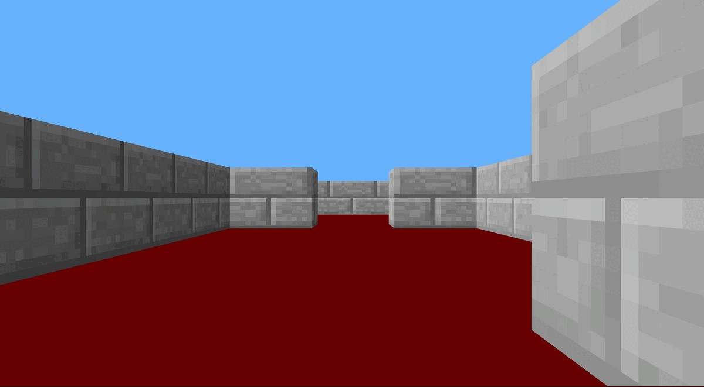

# cub3D
The idea is to create a 3D labyrinth in C with the help of the minilibX and X11 graphic server using `raycasting` (like Wolfenstein 3D). 
The map is a file ".cub" loaded as an argument of the executable.  
This project only works on Linux and WSL, make sur you have installed the required elements to run the minilibX. For more information, check : https://github.com/42Paris/minilibx-linux

All map errors like: invalid character, no spawn, map closed, etc, need to be handle.

### Preview


### Steps to run the game
```bash
$> make

$> ./cub3D maps/test.cub
```

### Controls
WASD to move.  
-> and <- to change the view direction
